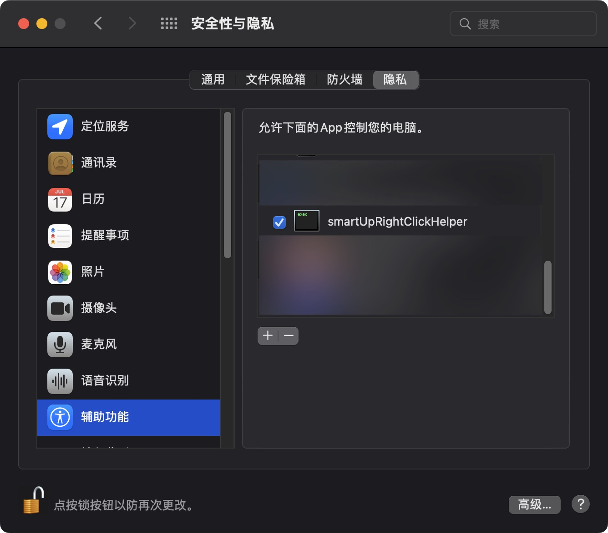

# smartUp手势 

一个更好的手势类扩展。功能包括：鼠标手势，简易拖曳，超级拖曳，摇杆手势和滚轮手势。

[](https://github.com/zimocode/smartup/issues)
[](https://github.com/zimocdoe/smartup/members)
[](https://github.com/zimocode/smartup/stargazers)
[](LICENSE)

[English](README.md) ·[简体中文](README-zh_CN.md)

## 安装右键助手
自行编译`rightClickHelper`目录下的go文件或者下载预编译文件。
赋予可执行权限后，先在终端测试能否正常运行，如正常运行应该会有如下输出

```shell
❯ ./darwin_arm64 
{"version": "0.7"}[debug] sent msg: {"version": "0.7"}
```

如果有类似下列输出，则表明依赖库不存在，需要自行安装依赖库后再编译。
```shell
❯ ./darwin_amd64 
dyld[60020]: Library not loaded: '/usr/local/opt/libpng/lib/libpng16.16.dylib'
  Referenced from: '~/smartup/rightClickHelper/darwin_amd64'
  Reason: tried: '/usr/local/opt/libpng/lib/libpng16.16.dylib' (no such file), '/usr/local/lib/libpng16.16.dylib' (no such file), '/usr/lib/libpng16.16.dylib' (no such file)
[1]    60020 abort      ./darwin_amd64
```
编译命令如下：
```shell
# On Ubuntu dependency of robotgo: libx11-dev xcb libxcb-xkb-dev x11-xkb-utils libx11-xcb-dev libxkbcommon-x11-dev libxtst-dev libpng++-dev
(cd rightClickHelper && go mod tidy && go build -ldflags "-s -w" -o rightClickHelper rightClickHelper.go)
```

编译成功后，按`GOOS_GOARCH`格式(如`linux_arm64`)重命名后，替换或补充在`rightClickHelper`目录下，执行`installRightClickHelper.sh`安装。

### macOS第一次点击右键时，会有授权弹窗提示


### 按图授权后，重启浏览器即可。


